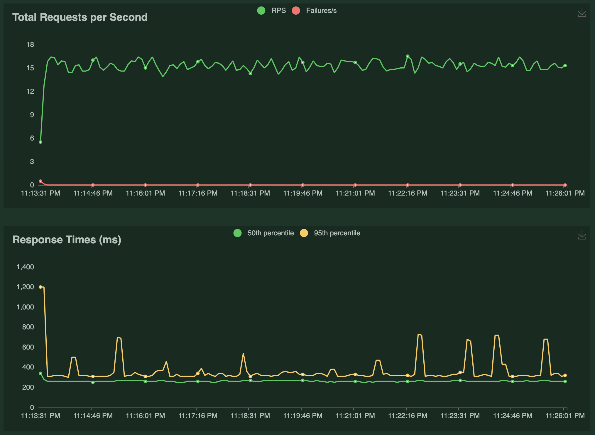

# Random Joke

## Overview

This web service combines two existing services: fetching a random name and a Chuck Norris joke, customizing the joke with the fetched name. Written in Go, it's designed for responsiveness and concurrent request handling.

## Getting Started

### Prerequisites
- Go installed on your system
- Docker, Docker compose
- For unit test: [mockery](https://vektra.github.io/mockery/latest/)
- For loadtest: python3

### How to run the project

```
# move to your workspace
cd your-work-space

# clone project
git clone git@github.com:phatdangx/random-joke.git

# move to project folder
cd random-joke

# run test
make test

# run the API application
make up

# make a test request
curl localhost:9090

# response looks like this
"Every SQL statement that Carlita Valle codes has an implicit \"COMMIT\" in its end."

# stop local project
make down

# clean dangling Docker images
make clean
```

## Project structure
This is a demonstration of how Clean Architecture principles can be applied in Go programming projects.

Guidelines of Clean Architecture as proposed by Uncle Bob:

- Framework-Neutral: The architecture is not reliant on any specific libraries or feature-heavy software, which means frameworks are used as interchangeable tools rather than being restrictive to the system's design.
- Testability: It's possible to test the core business logic independently of user interfaces, databases, servers, or other external components.
- UI-Agnostic: Changes to the user interface do not necessitate alterations in the system's core, allowing for flexibility in UI design, such as switching from a web-based interface to a console-based one without affecting the underlying business logic.
- Database-Independent: The system's business rules are not tied to any particular database, allowing for easy substitution between different database systems like Oracle, SQL Server, Mongo, or others.
- External Independence: The business rules are designed without any knowledge of or dependency on external systems or operations.


The project is structured into four main layers:

- Models Layer: This layer defines the data structures and business entities.
- Repository Layer: It handles data access and storage logic, acting as an intermediary between the data source and the use case layer.
- Usecase Layer: Also known as the Service Layer, this contains the application's business logic.
- Delivery Layer: This is the entry point of the application, where the data is delivered to and from the user interfaces.

## Performance Considerations

- ✅ The service is optimized for handling multiple concurrent requests.
- ✅ Responsiveness under load is a key feature.
- ✅ Unit test and load test increase the reliability
- ✅ Dockerize the application for easier deployment: apply 2 stages technique to reduce the final image size.
- ✅ Caching to improve perforamnce

### Unit Test

```
go test random-joke/handler -cover -count=1
ok      random-joke/handler     0.455s  coverage: 71.4% of statements
go test random-joke/model -cover -count=1
ok      random-joke/model       0.171s  coverage: [no statements]
go test random-joke/repository/external -cover -count=1
ok      random-joke/repository/external 0.210s  coverage: 40.0% of statements
go test random-joke/usecase -cover -count=1
ok      random-joke/usecase     0.165s  coverage: 100.0% of statements
```

Every time we update the interface, we need to regenerate the mocks to keep the unit tests up-to-date. Use this command:

```
mockery --all --output=mocks --outpkg=mocks
```

### Performance Test

I used [locust](https://locust.io/) to perform the load test. How to run the loadtest?

```
# move to the loadtest folder

cd your-work-space/random-joke/loadtest

# If you run loadtest for the first time, let's create a virtual environment for it

python3 -m venv .env

# activate the virtual environment

source .env/bin/activate

# if you it correct, you will see a prefix like this in your terminal: (.env)

# let's run the load test

locust -f locust.py

# now you can access to the load test UI at: http://0.0.0.0:8089

```

- [Initial Report](./loadtest/report_initial_test.html): In the initial test, where I implemented the standard flow of getting a random name and then using that name to fetch a random joke, the failure rate was around 30% of the total requests.


- [Report with retry mechanism](./loadtest/report_after_retry.html): After the first test, I observed that the Random Name service has a rate limit of approximately 10 requests per second. At times, if the service returned an error 429 (Too Many Requests), I could retry and still get a result. Therefore, I decided to explore the Exponential Backoff Mechanism. After implementation and testing, the failure rate dropped significantly to 6%. However, the response time also increased, from 300ms to 8000ms.


- [Report with caching mechanism](./loadtest/report_with_redis_cache.html): I then considered using Redis to cache names, so that whenever the third-party API is unavailable, I could use the cached name as a fallback. More details can be found in the Caching Strategy section. Overall, the results look promising, with the failure rate dropping to nearly 0% and the 95th percentile response time remaining around 300ms.



### Cache Strategy:
The caching strategy in the NameService uses Redis and follows a lazy-loading pattern. It operates as follows:

1. Cache Storage: When a name is fetched from an external service, it's cached in Redis with a unique timestamp-based key. This key is added to a set (randomName:index) for tracking. Each cached name has an expiration time of 5 minutes.

2. Fetching from Cache: If an API request fails or is unavailable, the service attempts to fetch the most recent name from the Redis cache. It retrieves the latest key from the randomName:index set and then fetches the corresponding name.

3. Fallback Mechanism: The primary method GetRandomName first tries to fetch a name from an external API. If this fails, it resorts to fetching the name from the cache.

This strategy helps in reducing dependencies on the external service by providing a fallback mechanism to retrieve recent data from the cache, ensuring efficiency and reliability.

### TODO

To maintain the production readiness, there are some future tasks as follows:

- 🟡 Write more tests to improve code coverage.
- 🟡 Build a CI/CD pipeline.
- 🟡 Deploy to a Kubernetes cluster to increase scalability.
- 🟡 Implement rate limiting to prevent abuse and DDoS attacks.

## Time Spent
Approximate time spent on this task: ~ 5 hours